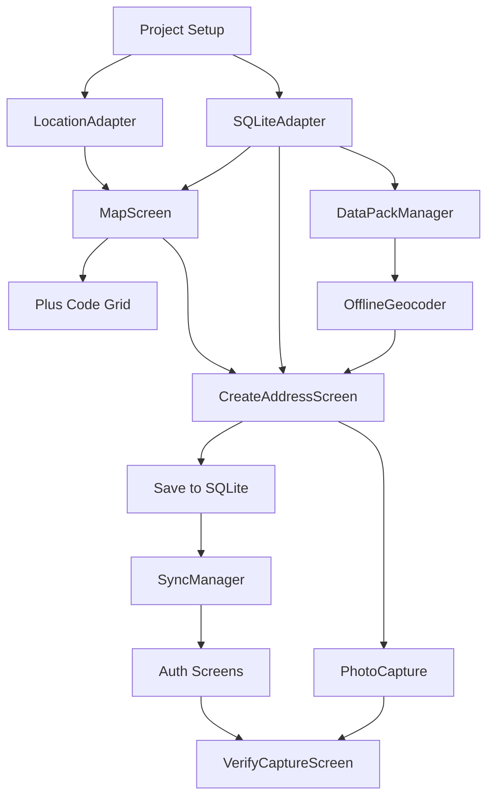

# Mobile Application - Implementation Plan

**Version:** 1.0  
**Date:** 2025-01-21  
**Estimated Duration:** 8-12 weeks (solo developer)

---

## 1. Pre-Development Setup

### 1.1 Development Environment

```bash
# Required tools
- Node.js 18+
- pnpm 8+
- Expo CLI: npm install -g expo-cli
- EAS CLI: npm install -g eas-cli
- Xcode 15+ (macOS, for iOS)
- Android Studio (for Android)
- Physical devices for GPS testing
```

### 1.2 Project Initialization

```bash
# Create Expo project with Dev Client template
npx create-expo-app janpams-mobile --template expo-template-blank-typescript

# Navigate to project
cd janpams-mobile

# Install EAS for building dev client
eas build:configure
```

### 1.3 Monorepo Integration

The mobile app should be added to the existing monorepo:

```
janpams-monorepo/
├── apps/
│   └── mobile/                    # NEW: Expo app
│       ├── app.config.ts
│       ├── package.json
│       ├── src/
│       │   ├── screens/
│       │   ├── components/
│       │   ├── adapters/          # Platform adapters
│       │   ├── stores/
│       │   └── navigation/
│       └── ...
├── packages/
│   ├── core/                      # Shared (already exists)
│   ├── types/                     # Shared (already exists)
│   └── mobile-adapters/           # NEW: RN-specific adapters
```

---

## 2. Phase Breakdown

### Phase 1: Foundation (Weeks 1-2)

**Goal:** Basic app structure, navigation, and shared logic integration

#### Week 1: Project Setup

| Task | Files | Priority |
|------|-------|----------|
| Initialize Expo project in monorepo | `apps/mobile/*` | P0 |
| Configure TypeScript paths | `tsconfig.json` | P0 |
| Set up navigation structure | `src/navigation/*` | P0 |
| Create placeholder screens | `src/screens/*` | P0 |
| Verify `@janpams/types` imports work | N/A | P0 |

```typescript
// Verify shared imports work
import { encode, decode } from '@janpams/core/pluscode';
import type { Address, GeoPosition } from '@janpams/types';

// This should compile without errors
const code = encode(3.8667, 11.5167, 10);
console.log(code); // Should output Plus Code
```

#### Week 2: Core Adapters

| Task | Files | Priority |
|------|-------|----------|
| Create LocationAdapter | `src/adapters/LocationAdapter.ts` | P0 |
| Create SQLiteAdapter | `src/adapters/SQLiteAdapter.ts` | P0 |
| Initialize database schema | `src/adapters/schema.sql` | P0 |
| Test GPS acquisition on device | N/A | P0 |

**Deliverable:** App that can acquire GPS and display coordinates

---

### Phase 2: Map & Location (Weeks 3-4)

**Goal:** Interactive map with Plus Code grid and GPS tracking

#### Week 3: Map Integration

| Task | Files | Priority |
|------|-------|----------|
| Install react-native-maps | `package.json` | P0 |
| Create MapScreen | `src/screens/MapScreen.tsx` | P0 |
| Implement user location tracking | `src/hooks/useUserLocation.ts` | P0 |
| Add GPS status indicator | `src/components/GPSIndicator.tsx` | P0 |

#### Week 4: Plus Code Grid

| Task | Files | Priority |
|------|-------|----------|
| Create PlusCodeGridOverlay | `src/components/map/PlusCodeGrid.tsx` | P1 |
| Implement grid visibility toggle | `src/stores/mapStore.ts` | P1 |
| Add zoom-based grid display | N/A | P1 |
| Test grid accuracy | N/A | P1 |

**Deliverable:** Map with user location and Plus Code grid overlay

---

### Phase 3: Address Creation (Weeks 5-6)

**Goal:** Complete address creation flow with offline support

#### Week 5: Address Form

| Task | Files | Priority |
|------|-------|----------|
| Create CreateAddressScreen | `src/screens/CreateAddressScreen.tsx` | P0 |
| Implement step-based flow | `src/components/address/*` | P0 |
| Integrate house number calculation | Uses `@janpams/core/address` | P0 |
| Add property type selector | `src/components/PropertyTypePicker.tsx` | P0 |

#### Week 6: Photo & Save

| Task | Files | Priority |
|------|-------|----------|
| Implement camera capture | `src/components/PhotoCapture.tsx` | P0 |
| Add GPS metadata to photos | `src/utils/photoMetadata.ts` | P0 |
| Implement "Create Upload Link" option | N/A | P1 |
| Save address to SQLite | Uses `SQLiteAdapter` | P0 |
| Add to sync queue | `src/offline/SyncQueue.ts` | P0 |

**Deliverable:** Can create address offline and queue for sync

---

### Phase 4: Offline Data Packs (Weeks 7-8)

**Goal:** Download and use offline street/boundary data

#### Week 7: Data Pack Download

| Task | Files | Priority |
|------|-------|----------|
| Create DataPacksScreen | `src/screens/DataPacksScreen.tsx` | P0 |
| Implement pack download | `src/offline/DataPackManager.ts` | P0 |
| Show download progress | `src/components/DownloadProgress.tsx` | P1 |
| Store packs in SQLite | N/A | P0 |

#### Week 8: Offline Geocoding

| Task | Files | Priority |
|------|-------|----------|
| Implement spatial queries | `src/offline/spatialQueries.ts` | P0 |
| Create OfflineGeocoder | `src/offline/OfflineGeocoder.ts` | P0 |
| Integrate with address creation | N/A | P0 |
| Test with no network | N/A | P0 |

**Deliverable:** Fully offline address creation with street lookup

---

### Phase 5: Sync & Auth (Weeks 9-10)

**Goal:** Background sync and user authentication

#### Week 9: Sync Manager

| Task | Files | Priority |
|------|-------|----------|
| Implement SyncManager | `src/offline/SyncManager.ts` | P0 |
| Register background task | `src/background/syncTask.ts` | P0 |
| Add sync status UI | `src/components/SyncBadge.tsx` | P0 |
| Handle network changes | `src/hooks/useNetworkState.ts` | P0 |

#### Week 10: Authentication

| Task | Files | Priority |
|------|-------|----------|
| Create LoginScreen | `src/screens/auth/LoginScreen.tsx` | P0 |
| Create SignupScreen | `src/screens/auth/SignupScreen.tsx` | P0 |
| Implement Supabase auth | `src/auth/supabaseAuth.ts` | P0 |
| Secure token storage | `src/auth/SecureStorage.ts` | P0 |
| Add auth guards | `src/navigation/AuthGuard.tsx` | P0 |

**Deliverable:** Authenticated app with background sync

---

### Phase 6: Verification & Polish (Weeks 11-12)

**Goal:** Image verification deep links and final polish

#### Week 11: Verification Flow

| Task | Files | Priority |
|------|-------|----------|
| Create VerifyCaptureScreen | `src/screens/VerifyCaptureScreen.tsx` | P1 |
| Implement deep link handling | `src/navigation/linking.ts` | P1 |
| Camera-only capture (no gallery) | N/A | P1 |
| Upload with token | N/A | P1 |

#### Week 12: Polish & Testing

| Task | Files | Priority |
|------|-------|----------|
| Address list screen | `src/screens/AddressListScreen.tsx` | P1 |
| Profile screen | `src/screens/ProfileScreen.tsx` | P2 |
| Error handling & edge cases | All files | P0 |
| Device testing (iOS + Android) | N/A | P0 |
| Performance optimization | N/A | P1 |

**Deliverable:** Production-ready beta

---

## 3. Task Dependency Graph



---

## 4. File Structure

```
apps/mobile/
├── app.config.ts                    # Expo configuration
├── eas.json                         # EAS Build config
├── package.json
├── tsconfig.json
├── babel.config.js
├── index.ts                         # Entry point
│
├── src/
│   ├── app/                         # Expo Router (if using)
│   │
│   ├── screens/
│   │   ├── MapScreen.tsx
│   │   ├── CreateAddressScreen.tsx
│   │   ├── AddressListScreen.tsx
│   │   ├── AddressDetailScreen.tsx
│   │   ├── DataPacksScreen.tsx
│   │   ├── ProfileScreen.tsx
│   │   ├── VerifyCaptureScreen.tsx
│   │   └── auth/
│   │       ├── LoginScreen.tsx
│   │       ├── SignupScreen.tsx
│   │       └── OTPScreen.tsx
│   │
│   ├── components/
│   │   ├── map/
│   │   │   ├── PlusCodeGrid.tsx
│   │   │   ├── StreetOverlay.tsx
│   │   │   └── LocationMarker.tsx
│   │   ├── address/
│   │   │   ├── AddressCard.tsx
│   │   │   ├── PropertyTypePicker.tsx
│   │   │   └── StreetPicker.tsx
│   │   ├── common/
│   │   │   ├── Button.tsx
│   │   │   ├── Input.tsx
│   │   │   └── Card.tsx
│   │   ├── GPSIndicator.tsx
│   │   ├── SyncBadge.tsx
│   │   ├── PhotoCapture.tsx
│   │   └── DownloadProgress.tsx
│   │
│   ├── adapters/
│   │   ├── LocationAdapter.ts       # expo-location wrapper
│   │   ├── SQLiteAdapter.ts         # expo-sqlite wrapper
│   │   ├── CameraAdapter.ts         # expo-camera wrapper
│   │   └── FileSystemAdapter.ts     # expo-file-system wrapper
│   │
│   ├── stores/
│   │   ├── mapStore.ts              # Zustand map state
│   │   ├── syncStore.ts             # Sync status
│   │   ├── authStore.ts             # Auth state
│   │   └── addressStore.ts          # Address cache
│   │
│   ├── offline/
│   │   ├── DataPackManager.ts       # Download/manage packs
│   │   ├── OfflineGeocoder.ts       # Reverse geocode offline
│   │   ├── SyncManager.ts           # Background sync
│   │   ├── SyncQueue.ts             # Queue operations
│   │   └── spatialQueries.ts        # SQLite spatial ops
│   │
│   ├── navigation/
│   │   ├── RootNavigator.tsx
│   │   ├── MainTabs.tsx
│   │   ├── AuthStack.tsx
│   │   ├── linking.ts               # Deep link config
│   │   └── AuthGuard.tsx
│   │
│   ├── auth/
│   │   ├── supabaseAuth.ts
│   │   └── SecureStorage.ts
│   │
│   ├── hooks/
│   │   ├── useUserLocation.ts
│   │   ├── useNetworkState.ts
│   │   ├── useAddresses.ts
│   │   └── useSyncStatus.ts
│   │
│   ├── queries/
│   │   ├── addresses.ts             # React Query hooks
│   │   ├── dataPacks.ts
│   │   └── auth.ts
│   │
│   ├── utils/
│   │   ├── photoMetadata.ts
│   │   ├── formatters.ts
│   │   └── validators.ts
│   │
│   └── constants/
│       ├── colors.ts
│       ├── layout.ts
│       └── config.ts
│
├── assets/
│   ├── images/
│   └── fonts/
│
└── __tests__/
    ├── adapters/
    ├── components/
    └── offline/
```

---

## 5. Key Implementation Details

### 5.1 Sharing Code from Monorepo

```typescript
// apps/mobile/package.json
{
  "dependencies": {
    "@janpams/types": "workspace:*",
    "@janpams/core": "workspace:*"
  }
}

// apps/mobile/tsconfig.json
{
  "compilerOptions": {
    "paths": {
      "@janpams/core/*": ["../../packages/core/src/*"],
      "@janpams/types": ["../../packages/types/src"]
    }
  }
}

// apps/mobile/metro.config.js
const { getDefaultConfig } = require('expo/metro-config');
const path = require('path');

const projectRoot = __dirname;
const workspaceRoot = path.resolve(projectRoot, '../..');

const config = getDefaultConfig(projectRoot);

// Watch packages directory
config.watchFolders = [workspaceRoot];

// Resolve packages from workspace
config.resolver.nodeModulesPaths = [
  path.resolve(projectRoot, 'node_modules'),
  path.resolve(workspaceRoot, 'node_modules'),
];

module.exports = config;
```

### 5.2 Platform-Specific Geolocation

```typescript
// src/adapters/LocationAdapter.ts
import * as Location from 'expo-location';
import { 
  getAddressAcquireConfig, 
  type AcquireResult 
} from '@janpams/core/geolocation';

export async function acquireTrustedPosition(): Promise<AcquireResult> {
  const config = getAddressAcquireConfig('mobile');
  
  // Request permissions
  const { status } = await Location.requestForegroundPermissionsAsync();
  if (status !== 'granted') {
    throw new Error('PERMISSION_DENIED');
  }
  
  // Use expo-location's high-accuracy mode
  const samples: Location.LocationObject[] = [];
  const startTime = Date.now();
  
  // Subscribe to location updates
  const subscription = await Location.watchPositionAsync(
    {
      accuracy: Location.Accuracy.BestForNavigation,
      timeInterval: config.sampleIntervalMs,
      distanceInterval: 0,
    },
    (location) => {
      samples.push(location);
    }
  );
  
  // Wait for minimum samples or timeout
  await new Promise((resolve) => {
    const check = setInterval(() => {
      const elapsed = Date.now() - startTime;
      const bestAccuracy = Math.min(...samples.map(s => s.coords.accuracy || 999));
      
      if (
        (samples.length >= config.minSamples && bestAccuracy <= config.targetAccuracyM) ||
        elapsed >= config.maxWaitMs
      ) {
        clearInterval(check);
        resolve(undefined);
      }
    }, 500);
  });
  
  subscription.remove();
  
  // Find best sample
  const best = samples.reduce((a, b) => 
    (a.coords.accuracy || 999) < (b.coords.accuracy || 999) ? a : b
  );
  
  return {
    lat: best.coords.latitude,
    lon: best.coords.longitude,
    accuracy: best.coords.accuracy || 999,
    trustLevel: determineTrustLevel(best.coords.accuracy || 999),
    captureMethod: 'gps',
    samplesUsed: samples.length,
  };
}
```

---

## 6. Testing Checklist

### 6.1 Device Testing Matrix

| Device | OS Version | Test Focus |
|--------|------------|------------|
| iPhone 12+ | iOS 15+ | GPS accuracy, camera |
| iPhone SE | iOS 14 | Small screen, performance |
| Pixel 6+ | Android 12+ | GPS, background sync |
| Samsung A-series | Android 10 | Low-end performance |

### 6.2 Critical Test Scenarios

- [ ] GPS acquisition in urban area (high buildings)
- [ ] GPS acquisition in rural area (weak signal)
- [ ] Address creation while offline
- [ ] Sync after extended offline period
- [ ] Camera capture with GPS metadata
- [ ] Deep link handling from SMS
- [ ] App backgrounding during sync
- [ ] Low storage conditions

---

## 7. Handoff Checklist for Mobile Developer

Before starting:

- [ ] Access to monorepo repository
- [ ] Expo EAS account configured
- [ ] Apple Developer account (for iOS)
- [ ] Google Play Console access (for Android)
- [ ] Backend API credentials (Supabase URL/keys)
- [ ] Test devices (iOS + Android)
- [ ] Reviewed SRD, SPECS, and this plan
- [ ] Understood shared package interfaces

---

## Document History

| Version | Date | Author | Changes |
|---------|------|--------|---------|
| 1.0 | 2025-01-21 | JanPAMS Team | Initial version |
