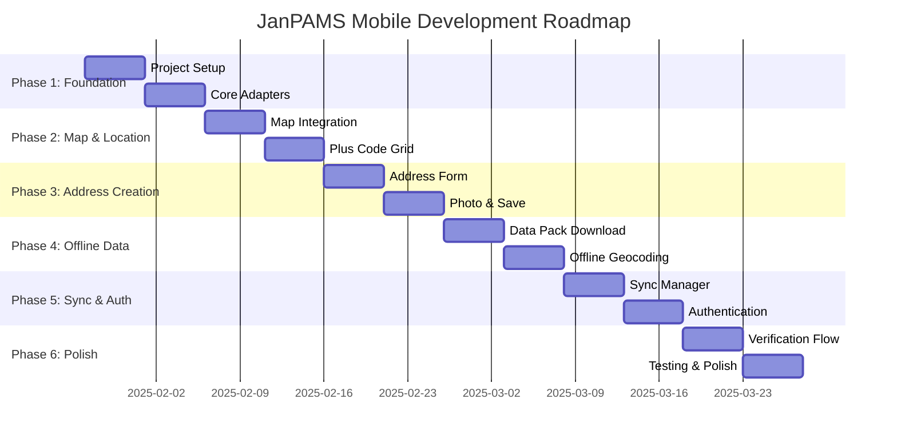

# Mobile Application - Development Roadmap

**Version:** 1.0  
**Date:** 2025-01-21  
**Timeline:** 12-16 weeks total

---

## Timeline Overview



---

## Phase Details

### Phase 1: Foundation (Weeks 1-2)

**Objective:** Establish project structure and core adapters

#### Milestones

| Milestone | Target Date | Success Criteria |
|-----------|-------------|------------------|
| M1.1: Project compiles | End of Week 1 | `expo start` runs without errors |
| M1.2: Shared imports work | End of Week 1 | Can import from `@janpams/core` |
| M1.3: GPS works on device | End of Week 2 | Acquire position on physical device |
| M1.4: SQLite initialized | End of Week 2 | Create/read from local database |

#### Key Decisions

- [ ] Use Expo Router vs React Navigation?
- [ ] Use Dev Client from start or later?
- [ ] UI library: Tamagui, NativeWind, or custom?

#### Risks

| Risk | Mitigation |
|------|------------|
| Monorepo module resolution issues | Test early, use Metro config |
| Expo SDK compatibility with packages | Pin versions, test imports |

---

### Phase 2: Map & Location (Weeks 3-4)

**Objective:** Interactive map with GPS tracking

#### Milestones

| Milestone | Target Date | Success Criteria |
|-----------|-------------|------------------|
| M2.1: Map displays | End of Week 3 | Full-screen map with tiles |
| M2.2: User location shown | End of Week 3 | Blue dot follows user |
| M2.3: Plus Code grid overlay | End of Week 4 | Grid visible at zoom > 17 |
| M2.4: GPS status indicator | End of Week 4 | Shows accuracy + trust level |

#### Key Decisions

- [ ] Map provider: Google Maps, Mapbox, or Apple Maps?
- [ ] Tile caching strategy for offline?

#### Risks

| Risk | Mitigation |
|------|------------|
| Plus Code grid performance at scale | Use tile-based rendering, cull off-screen |
| GPS accuracy varies by device | Show clear feedback, allow retry |

---

### Phase 3: Address Creation (Weeks 5-6)

**Objective:** Complete offline-capable address creation

#### Milestones

| Milestone | Target Date | Success Criteria |
|-----------|-------------|------------------|
| M3.1: Address form complete | End of Week 5 | All fields editable |
| M3.2: House number calculated | End of Week 5 | Uses `@janpams/core/address` |
| M3.3: Photo capture works | End of Week 6 | Camera opens, captures image |
| M3.4: GPS metadata embedded | End of Week 6 | EXIF shows coordinates |
| M3.5: Address saved locally | End of Week 6 | Visible in SQLite |

#### Key Decisions

- [ ] Step-by-step wizard vs single scrollable form?
- [ ] Camera: full-screen or embedded?

#### Risks

| Risk | Mitigation |
|------|------------|
| Photo file size too large | Compress before save |
| Form validation complexity | Use shared validators from core |

---

### Phase 4: Offline Data Packs (Weeks 7-8)

**Objective:** Download and use offline geocoding data

#### Milestones

| Milestone | Target Date | Success Criteria |
|-----------|-------------|------------------|
| M4.1: Pack list fetched | End of Week 7 | Shows available regions |
| M4.2: Pack downloads | End of Week 7 | Progress bar, handles interruption |
| M4.3: Streets queryable | End of Week 8 | Find street within 60m radius |
| M4.4: Boundaries queryable | End of Week 8 | Determine city/neighborhood |

#### Key Decisions

- [ ] Pack format: JSON, Protocol Buffers, or SQLite?
- [ ] Partial pack updates or full replacement?

#### Risks

| Risk | Mitigation |
|------|------------|
| Large pack files (>50MB) | Split by city, compress heavily |
| SQLite query performance | Add spatial indexes, optimize bbox |

---

### Phase 5: Sync & Auth (Weeks 9-10)

**Objective:** Reliable sync and secure authentication

#### Milestones

| Milestone | Target Date | Success Criteria |
|-----------|-------------|------------------|
| M5.1: Sync queue processes | End of Week 9 | Pending items upload when online |
| M5.2: Background sync works | End of Week 9 | Syncs even when app backgrounded |
| M5.3: Login works | End of Week 10 | Phone + PIN auth successful |
| M5.4: Session persists | End of Week 10 | Stays logged in after restart |

#### Key Decisions

- [ ] Sync frequency: aggressive or conservative?
- [ ] Handle large sync backlog (>100 items)?

#### Risks

| Risk | Mitigation |
|------|------------|
| Sync conflicts with server | Implement last-write-wins or prompt user |
| Token refresh failures | Queue operations, retry after re-auth |

---

### Phase 6: Verification & Polish (Weeks 11-12)

**Objective:** Deep link verification and production readiness

#### Milestones

| Milestone | Target Date | Success Criteria |
|-----------|-------------|------------------|
| M6.1: Deep links open app | End of Week 11 | `/verify/:token` handled |
| M6.2: Camera-only capture | End of Week 11 | No gallery access |
| M6.3: Upload succeeds | End of Week 11 | Image sent to backend |
| M6.4: All screens complete | End of Week 12 | Address list, profile, settings |
| M6.5: Device testing pass | End of Week 12 | iOS + Android work |

#### Key Decisions

- [ ] Universal Links vs Custom URL scheme?
- [ ] Crashlytics or Sentry for monitoring?

#### Risks

| Risk | Mitigation |
|------|------------|
| iOS/Android behavior differences | Test on both platforms early |
| App Store review delays | Submit early with minimal viable features |

---

## Post-MVP Roadmap (Weeks 13+)

### Phase 7: Enhanced Features (Weeks 13-14)

- [ ] Biometric authentication (Face ID / fingerprint)
- [ ] Offline map tiles (full tile caching)
- [ ] Street direction visualization
- [ ] Address sharing via QR code

### Phase 8: Field Agent Tools (Weeks 15-16)

- [ ] Batch address creation mode
- [ ] GPS track recording
- [ ] Offline assignment sync
- [ ] Supervisor dashboard access

### Phase 9: Advanced Offline (Future)

- [ ] Delta sync (only changed data)
- [ ] P2P sync between devices
- [ ] Conflict resolution UI
- [ ] Encrypted local database

---

## Success Metrics

### MVP Launch Criteria

| Metric | Target |
|--------|--------|
| Can create address offline | 100% |
| Sync success rate | > 99% |
| GPS L1 achievement rate | > 70% |
| App crash rate | < 0.5% |
| Cold start time | < 3 seconds |

### Post-Launch KPIs

| Metric | Target (Month 1) | Target (Month 3) |
|--------|------------------|------------------|
| Daily active users | 100 | 1,000 |
| Addresses created | 1,000 | 10,000 |
| Sync failure rate | < 1% | < 0.1% |
| App store rating | > 4.0 | > 4.5 |

---

## Resource Requirements

### Development

| Role | Allocation | Notes |
|------|------------|-------|
| Mobile Developer | 100% | Primary implementer |
| Backend Support | 10% | API questions, edge functions |
| Design | 20% | Screen mockups, assets |
| QA | 30% | Device testing in Phase 6 |

### Infrastructure

| Resource | Purpose |
|----------|---------|
| Expo EAS | Cloud builds |
| TestFlight | iOS beta testing |
| Google Play Internal Testing | Android beta |
| Physical devices | GPS testing |

### Budget Considerations

| Item | Estimated Cost |
|------|----------------|
| Apple Developer Account | $99/year |
| Google Play Developer | $25 one-time |
| Expo EAS (Pro) | $99/month |
| Test devices | $500-1000 one-time |

---

## Communication & Reporting

### Weekly Sync

- Day: Every Monday
- Format: 30-min video call
- Agenda: Progress, blockers, demos

### Milestone Reviews

- End of each phase
- Demo to stakeholders
- Go/no-go for next phase

### Documentation

- Update this roadmap weekly
- Log technical decisions in ADR format
- Maintain component storybook (optional)

---

## Appendix: Quick Reference

### Shared Package Imports

```typescript
// Types
import type { Address, GeoPosition } from '@janpams/types';

// Plus Code (pure)
import { encode, decode } from '@janpams/core/pluscode';

// Address algorithms (pure)
import { calculateHouseNumber } from '@janpams/core/address';

// Trust thresholds (config)
import { GEOLOCATION_THRESHOLDS } from '@janpams/core/geolocation';
```

### Native Replacements Cheat Sheet

| Web | Mobile |
|-----|--------|
| `navigator.geolocation` | `expo-location` |
| `IndexedDB (idb)` | `expo-sqlite` |
| `localStorage` | `expo-secure-store` |
| `MapLibre GL JS` | `react-native-maps` |
| `<input type="file">` | `expo-image-picker` |
| `<video capture>` | `expo-camera` |

---

## Document History

| Version | Date | Author | Changes |
|---------|------|--------|---------|
| 1.0 | 2025-01-21 | JanPAMS Team | Initial version |
